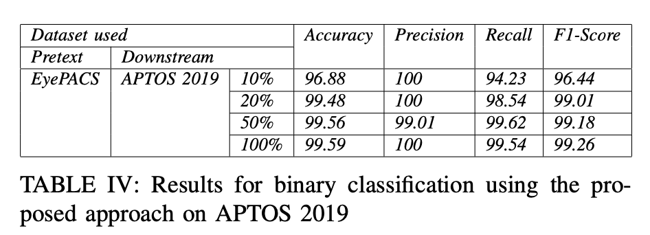
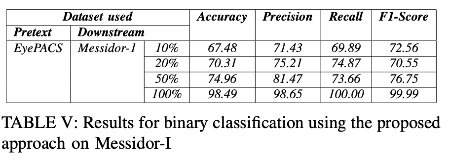
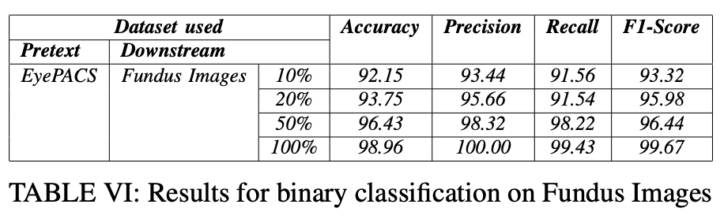
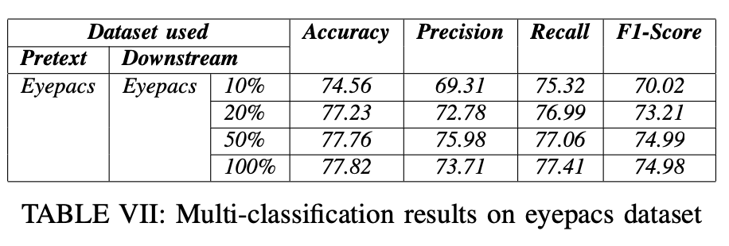
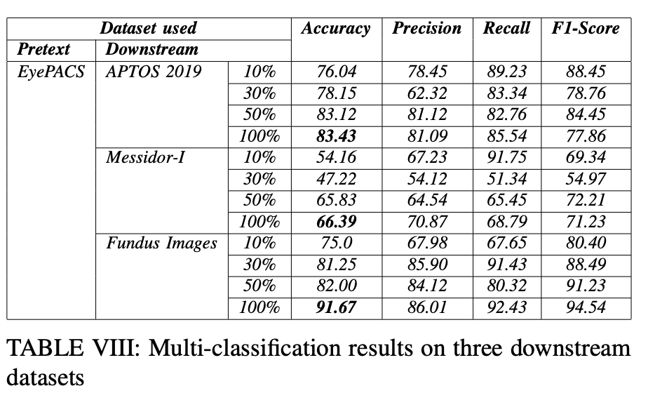
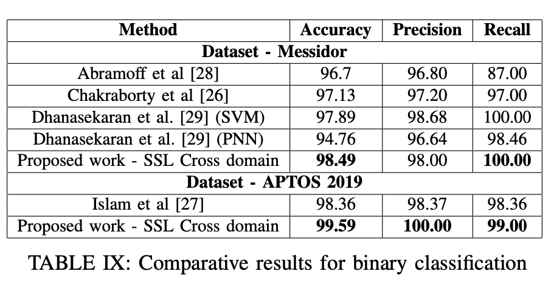
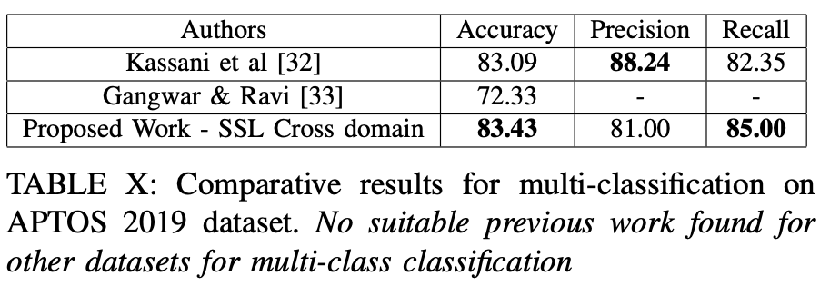
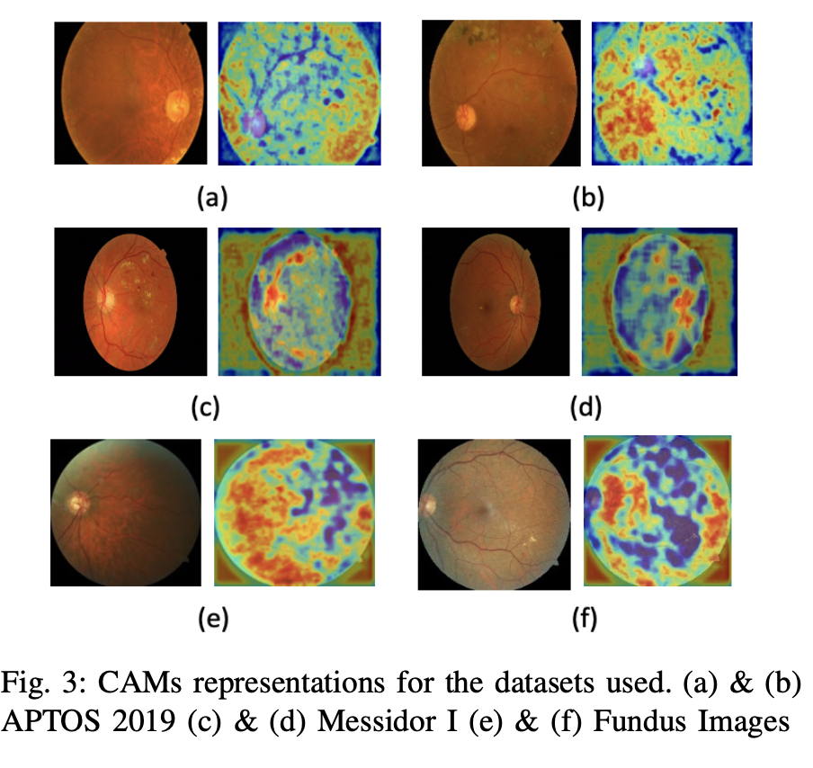

# Title

Learning Self-Supervised Representations for Label Efficient Cross-Domain Knowledge Transfer on Diabetic Retinopathy Fundus Images

# Venue

Accepted in International Joint Conference on Neural Networks (IJCNN) 2023


# Article

[Arxiv Version]()


# Abstract

This work presents a novel label-efficient self- supervised representation learning-based approach for classifying diabetic retinopathy (DR) images in cross-domain settings. Most of the existing DR image classification methods are based on supervised learning which requires a lot of time-consuming and expensive medical domain experts-annotated data for training. The proposed approach uses the prior learning from the source DR image dataset to classify images drawn from the target datasets. The image representations learned from the unlabeled source domain dataset through contrastive learning are used to classify DR images from the target domain dataset. Moreover, the proposed approach requires a few labeled images to perform successfully on DR image classification tasks in cross-domain settings. The proposed work experiments with four publicly available datasets: EyePACS, APTOS 2019, MESSIDOR-I, and Fundus Images for self-supervised representation learning-based DR image classification in cross-domain settings. The proposed method achieves state-of-the-art results on binary and multi- classification of DR images, even in cross-domain settings. The proposed method outperforms the existing DR image binary and multi-class classification methods proposed in the literature. The proposed method is also validated qualitatively using class activation maps, revealing that the method can learn explainable image representations. The source code and trained models are published on GitHub

# Domain Adaptation by Self-supervised Reporesentation Learning Method
[SimCLR](http://proceedings.mlr.press/v119/chen20j.html) contrastive learning method employed for self-supervised representation learning part.
<p align="center">
  
</p>

# Datasets
Four publically available datasets from remote sensing domain are chosen for exprimentations.

1. [Subset of EyePACS](http://www.lmars.whu.edu.cn/prof_web/zhongyanfei/e-code.html) - Eye disease Diabetic Retinopathy (DR) is linked to long- term diabetes. If DR is caught early enough, visual loss can be halted. A comprehensive collection of high-resolution retina images captured using various imaging settings are accessible. Every subject has both a left and right field available to them. Images are identified not just with a subject id but also as being on the left or the right. A medical professional has determined diabetic retinopathy on a scale of 0 to 4.
2. [Aptos 2019](http://www.lmars.whu.edu.cn/prof_web/zhongyanfei/e-code.html) - Numerous people are affected by diabetic retinopathy, the most common reason for vision loss among adults in their 40s and 50s. Aravind Eye Hospital can help people in rural areas without easy access to medical screening in India’s efforts to find and prevent this condition there. The answers will be available to other Ophthalmologists through the 4th Asia Pacific Tele-Ophthalmology Society (APTOS) Symposium . A vast collection of retina images was collected using fundus photography in various situations made available. A clinical expert has determined that each image has been graded for its severity on a scale of 0 to 4.
3. [MESSIDOR-I](http://weegee.vision.ucmerced.edu/datasets/landuse.html) - Diabetic retinopathy detection is now a labor-intensive and time-consuming method that requires a qualified doctor to use digital color fundus images of the retina. It is known as MESSIDOR (Methods to Evaluate Segmentation and Indexing Techniques in the Field of Retinal Ophthalmology in French). The retinopathy grades are determined on a scale of 0 to 3.
4. [Fundus Images](https://data.mendeley.com/datasets/7j9bv9vwsx/2) - The Department of Ophthalmology provided the 757 color fundus images included in this collection from the Hos- pital de Clnicas, Facultad de Ciencias Me ́dicas, Universidad Nacional de Asuncio ́n, Paraguay. The Zeiss brand’s Visucam 500 camera was utilized for the process of acquiring the retinographies. Fundus images have been classified into 7 distinct groups on a scale of 1 to 7.

# Model Weights
 
1. [SSL Pretrained Model](Pretext_Checkpoints/pretext chkpt)

# Results
All the expriments have batch size of 256 and ResNet50 encoder.
<p align="center">
  
</p>

<p align="center">
  
</p>

<p align="center">
  
</p>
<p align="center">
  
</p>

<p align="center">
  
</p>

<p align="center">
  
</p>

<p align="center">
  
</p>

# Qualitative
<p align="center">
  
</p>


  
# Commands

1. Pretrain

``````

2. Finetune - downstream task

``````
